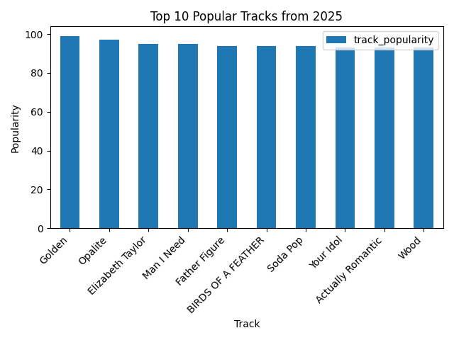
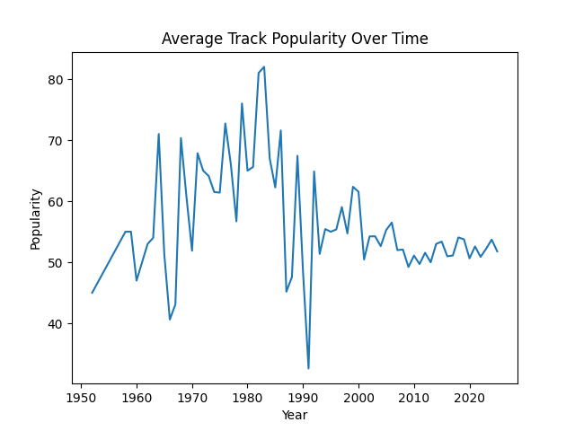
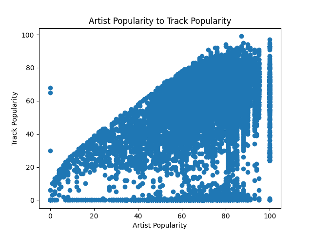
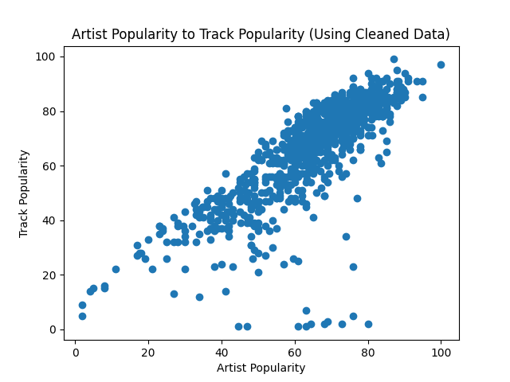
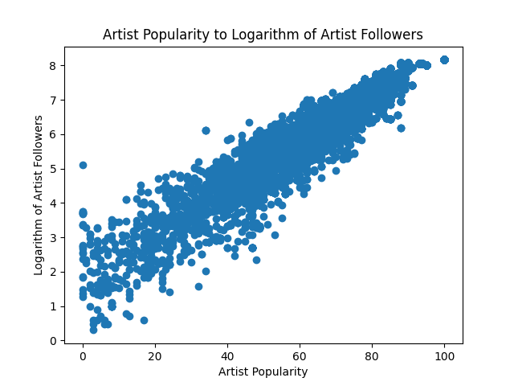

# Data Visualization for Spotify Global Music Data

This project explores the visualization of popular tracks and artists on Spotify between 2009-2025.

Our data source is from Kaggle.
https://www.kaggle.com/datasets/wardabilal/spotify-global-music-dataset-20092025

We used Python libraries, including pandas and matplotlib, to visualize trends in the data.

## Data

The raw data contains music tracks spanning 16 years from 2009 to 2025. 

There are 8582 unique track ids recorded, each accompanied with information over a wide range. For example, this includes:
* Track name
* Track popularity
* Whether the song is explicit or not
* The name of the song's artist
* That artist's popularity
* That artist's follower count (On Spotify)
* Artist genres

## Visualization

### Top 10 Popular Tracks

This was the first visualization that I did. 
For starters, I was unfamiliar with the python libraries--pandas and matplotlib. I started with a simple bar graph that has straightforward metrics. These metrics included the track popularity and track name. 

While doing this project, I learned about the basics of data visualization. For example, I firstmost learned what a datafile was, as well as how to sort the data file. I learned simply how to graph using matplotlib, along with using .head() to taken on the first ten values. 

### Music Popularity Trend

This was the second visualization. This visualization was more difficult than the last; I wanted to choose a line graph, as well as a more complex prompt that could showcase trends instead of plain statistics. 

Initially, I wanted to model the popularity of different genres over time, but my approach found that the genres listed in the datafile were so diverse that the visualization could not showcase any trends. For example, one song was labeled under the genre 'neo-psychedelic', while I was looking for general categories such as pop or 90's rap. 

Thus, I decided to switch the prompt, and then chose average track popularity over time, in which I could change the label to something quantifiable. I found that choosing the mean instead of the sum of track popularities would better fit because the number of tracks per year varied. 

The next challenge I encountered was that the data needed to be cleaned. The release date was put in terms of year-month-day, but I only needed the year for my data. I learned that I could use a function to convert the string to a datatime type that could extract the year. 

The graph shows an increase in average track popularity from the 1950s to the 1980s, peaking around 1983 at a popularity of about 80. Then, it dropped in the early 1990s, and later stabilized at around 50-55 in the later years. This means that 80's music was generally more popular and there were very popular artists at the time. For example, popular 80s artists include Michael Jackson, Whitney Houston, and Madonna, who are all incredibly influential in the music industry.

### Track to Artist Popularity

This was the next visualization I did, which was a scatter plot. I chose to visualize the relationship between Track Popularity to Artist popularity, in order to see if the popularity of an artist always affects the popularity of their work. 

The Graph shows that there is mostly a positive correlation between the two, indicating that artist popularity does indeed affect track popularity. However, there is also a string of points along the bottom, which shows that even for popular artists, not all of their tracks become popular. 

However, this graph is difficult to interpret in a couple of ways. 
* The graph is unappealing in that roughly half of the white space is covered in dots. Thus, it is hard to tell what the actual distribution of data looks like. This is likely because many artists have multiple songs each, resulting in an abundance of values.
* There is a long string of values where the track popularity is equal to zero. This must mean that the track popularity data is missing data or has unreliable data, such as missing track values or artists that post songs that barely receive any traction.
* This results in a graph that cannot show strong correlation

Thus, I needed to find a way to clean the data, which would include reducing the amount of values as well as unnecessary noise. Looking closer into the data, I eventually produced another graph. 

This graph solves the problem in the first graph in a few ways. 
* Firstly, I created a new dataframe that aggregated track popularity by its maximum value, grouping the resulting values by artist.
* Next, in the new dataframe, I counted the number of track ids, also grouped by artists.
* Finally, I cleaned out extraneous data by only taking tracks with a popularity greater than zero and artists who had two or more songs. This significantly reduced the number of data values as well as noise.

Finally, the graph is interepretable. The scatter plot shows that artist popularity and track popularity have a strong positive correlation, meaning that as an artist becomes more popular, the songs they produce naturally will as well. 

From this experience, I learned a couple things. The first was how to aggregate multiple columns using the groupby() method, which will take values in groups and not the entire column as I did previously. The second thing was the general process of data cleaning by taking constraints that limit unnecessary or unhelpful data. 

### Artist Popularity to Followers

This was another scatter plot I did, which visualizes the relationship between an artists poularity to their follower count. 

I visualized raw data multiple times, using different ceiling numbers to control the range of follower counts. This was because there were likely 5-10 artists that had extremely high follower counts compared to the rest, which skewed the data. However, no matter which ceiling number I used, there was always an exponential relationship between the two values, which indicates that as an artist grows more popular, their follower count grows exponentially. 

In order to confirm this relationship of exponential growth, I decided to apply a Log Transformation for the follower count, and produced a second graph. 

This is the graph that shows the Log Transformation on the follower count. The relationship has turned from exponential to linear, confirming the exponential relationship between the two metrics. 