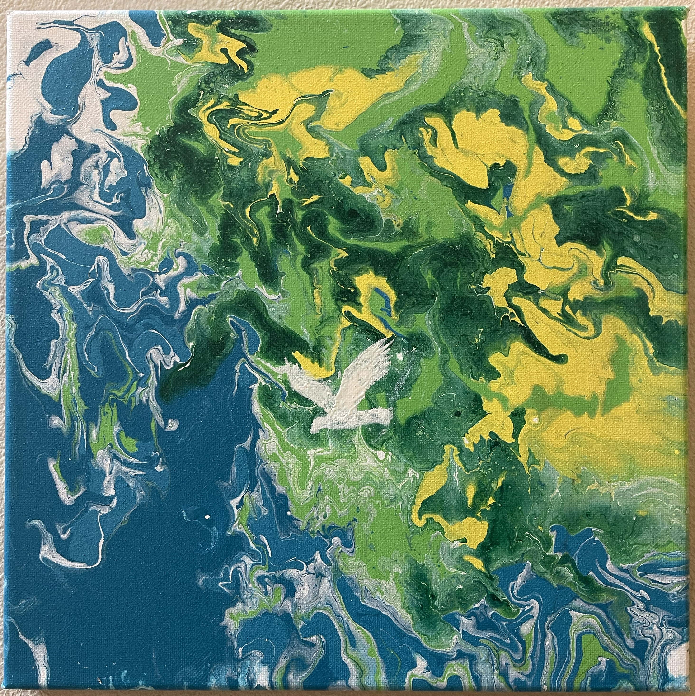
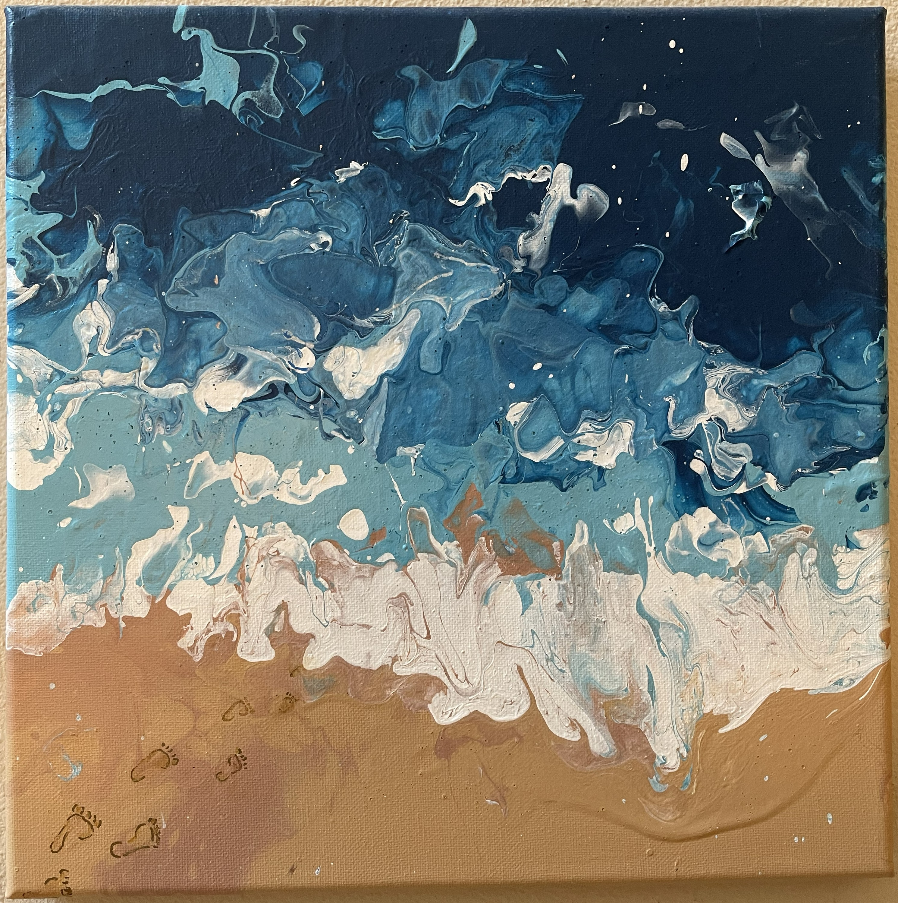
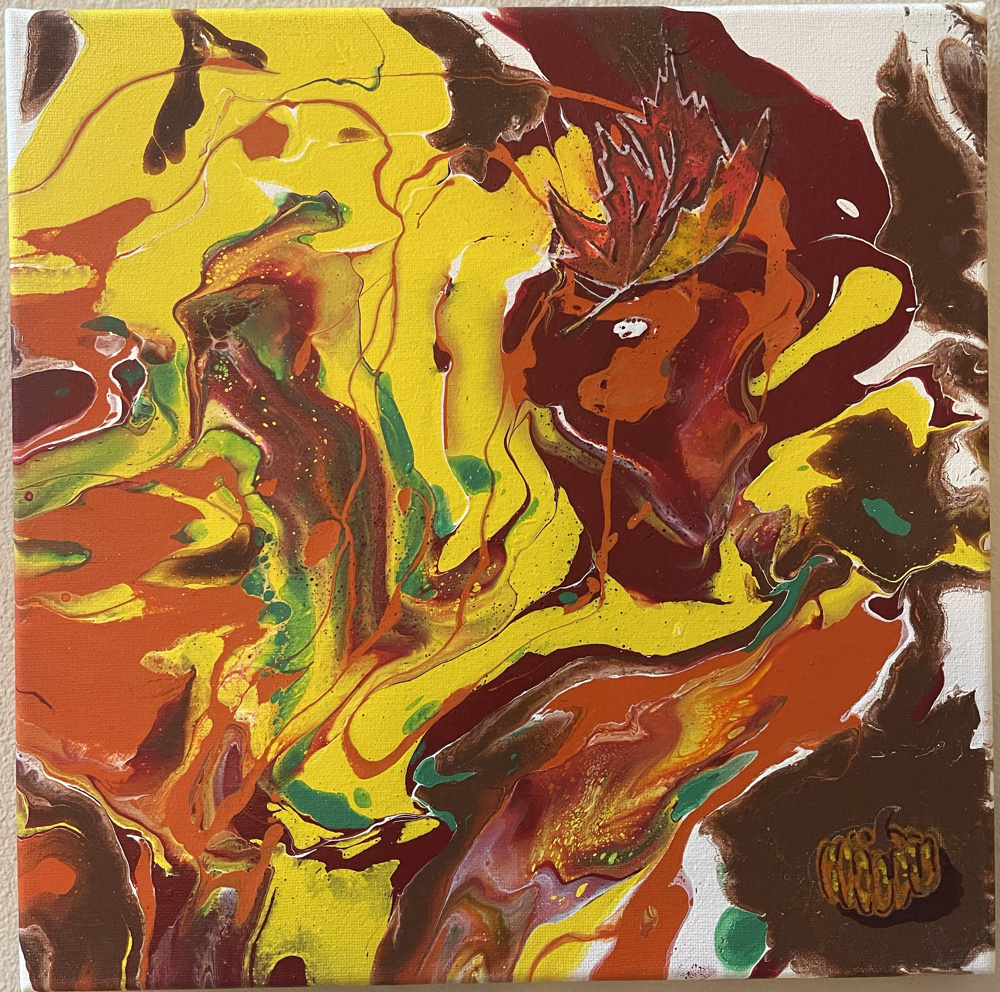
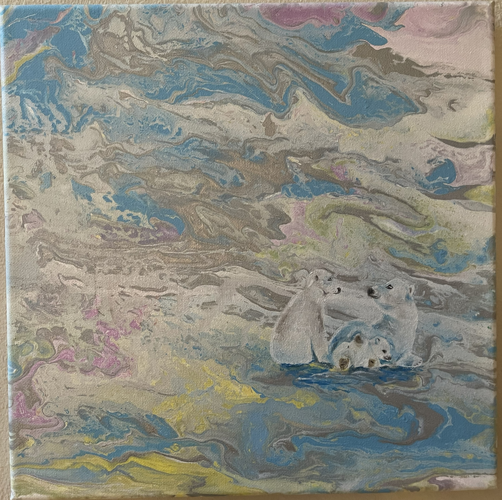
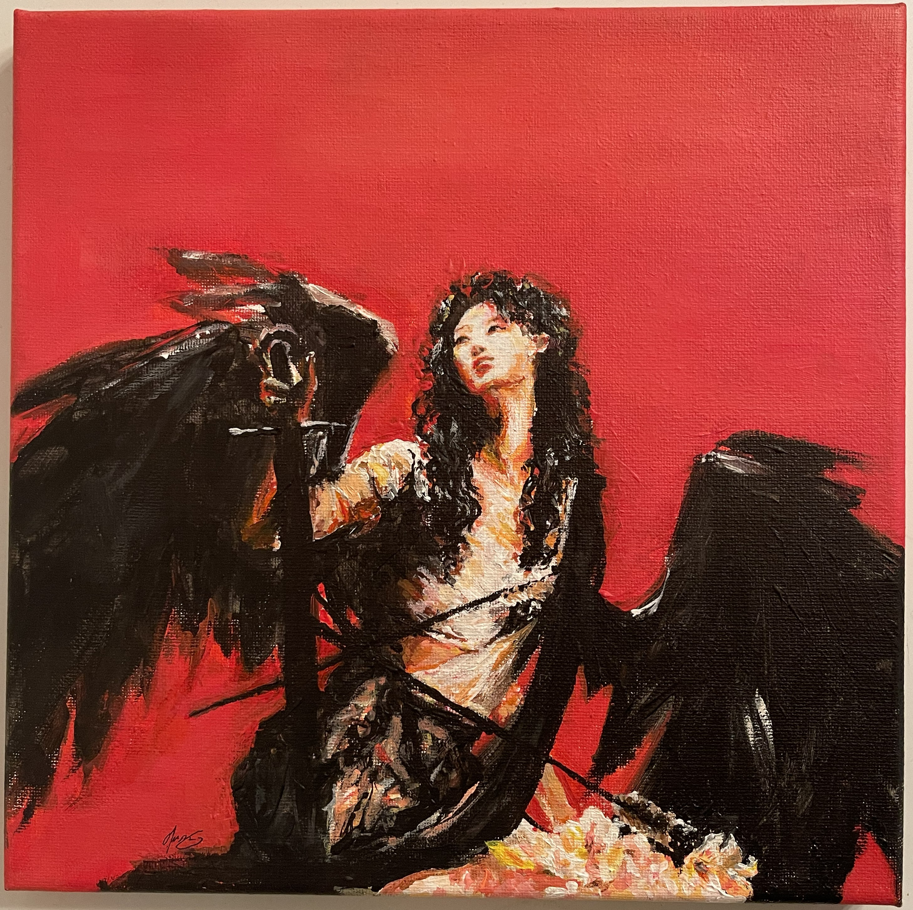
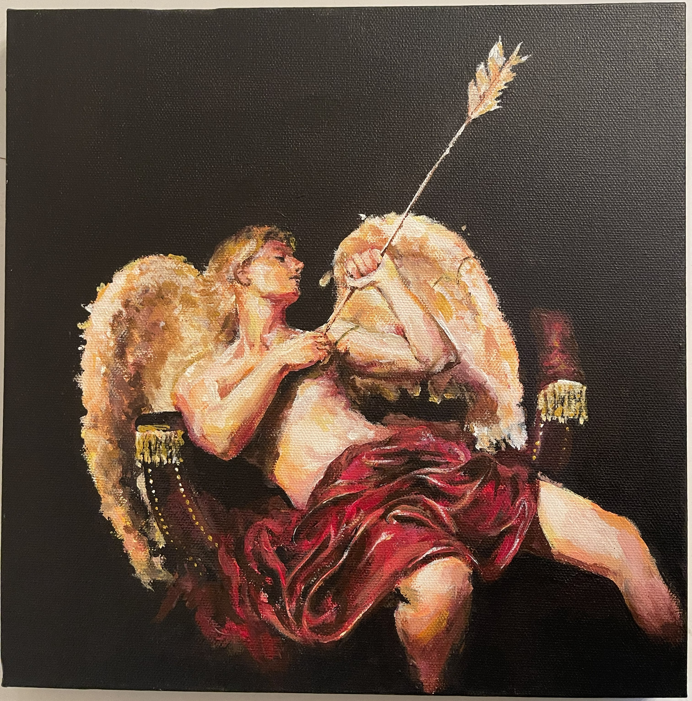
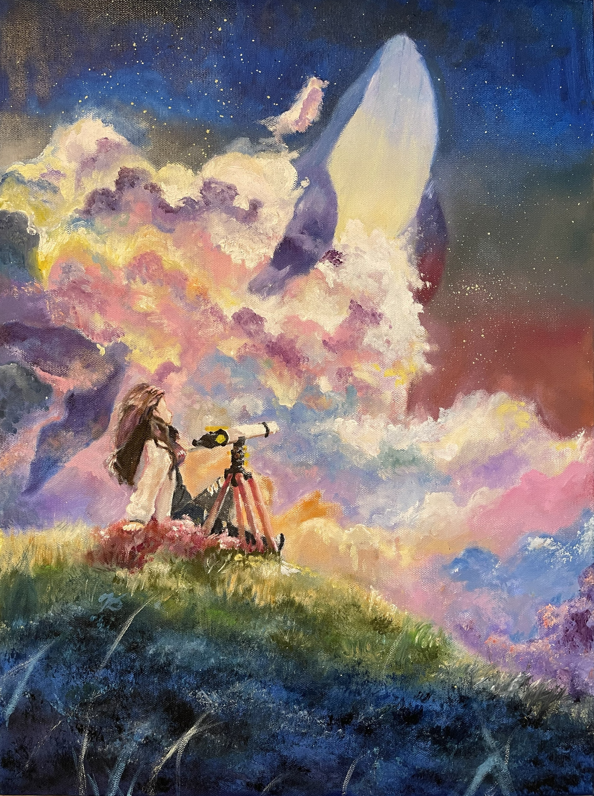

# Path of Colors

This repository showcases my art journey, from my first acrylic pour to my favorite oil paintings. Throughout this journey, I've learned to appreciate the beauty of the world, as well as enhance my technical art skills in perspective, anatomy, and color theory. 

## Four seasons (Acrylic, 12x12)

<table width="100%">
  <tr>
    <td width="50%", valign="top">
        Eyes drift to the swallow as it flies by,  
        When the lively clouds all come out to play;  
        So the roosters call, and the tulips shy,  
        To splash dawn's sweet light on the new-born day. 
    </td>
    <td width="50%">
        
    </td>
  </tr>
  <tr>
    <td width="50%", valign="top">
        Then it warms, so to say, near the lake's shore, 
        The hummingbirds then sing in falsetto, 
        and we bask beneath our sun's burning core, 
        So footprints paint the balmy sand aglow. 
  
    </td>
    <td width="50%">
        
    </td>
  </tr>
  <tr>
    <td width="50%", valign="top">
        Then leafy greens turn red, crisp into brown, 
        And reddish pumpkins adorn the street house, 
        When the first snow kisses bright leafy ground, 
        And time stops, free from all our crooked doubts. 
    </td>
    <td width="50%">
        
    </td>
  </tr>
  <tr>
    <td width="50%", valign="top">
        Such is the cyclical way of the earth, 
        When death of nature results in rebirth. 
    </td>
    <td width="50%">
        
    </td>
  </tr>
</table>

## Female Angel, Male Angel (Acrylic, 12x12)

<table width="100%">
  <tr>
    <td width="50%", valign="top">
        We lay poised with the other in intention,  
        My sick line of blood stops then where you begin, 
        So the organ which pumps swells in distention, 
    </td>
    <td width="50%">
        
    </td>
  </tr>
  <tr>
    <td width="50%", valign="top">
        When the arrow of Paris lands on raw skin, 
        And the loveliest wings begin to collapse, 
        The love which keeps us apart starts to wear thin, 
    </td>
    <td width="50%">
        
    </td>
  </tr>
  <tr>
    <td width="50%", valign="top">
        And when in your mind my lovely image cracks, 
    </td>
    <td width="50%">
    </td>
  </tr>
</table>

## Whale in the Sky (Oil paint, 18x24)

<table width="100%">
  <tr>
    <td width="70%">
        
    </td>
    <td width="30%", valign="top">
        Eyes that travel far, 
        Results not in yearning, but 
        Lovely stagnation. 
    </td>
  </tr>
</table>
