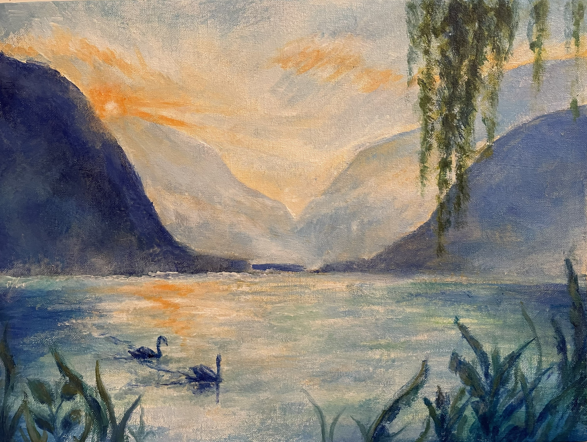
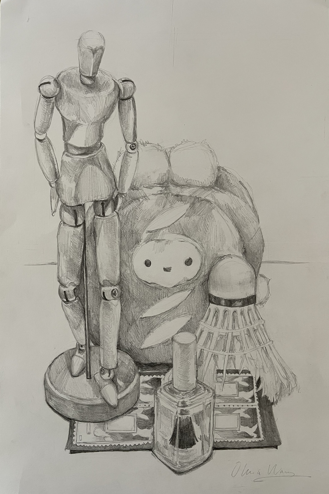
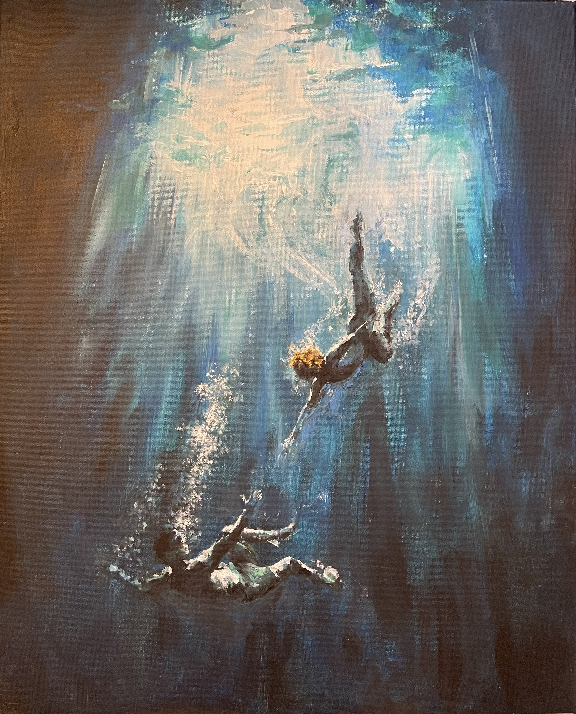
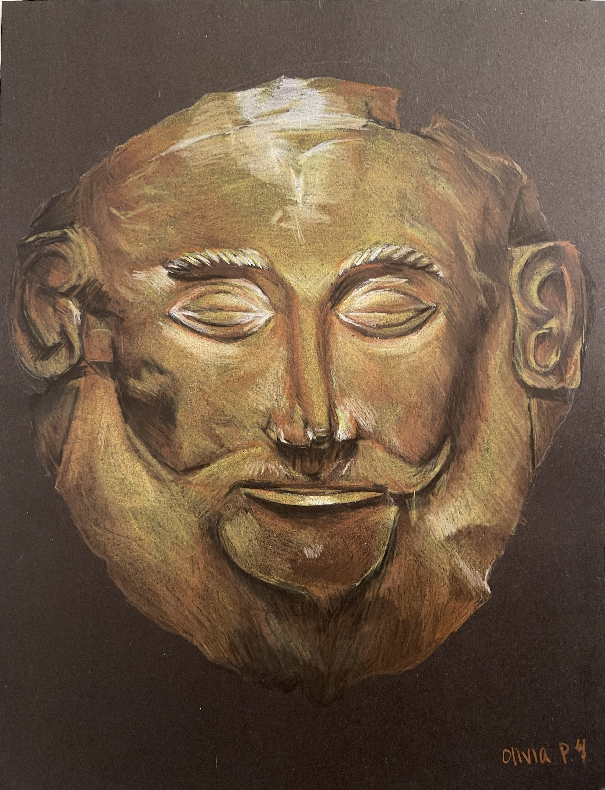
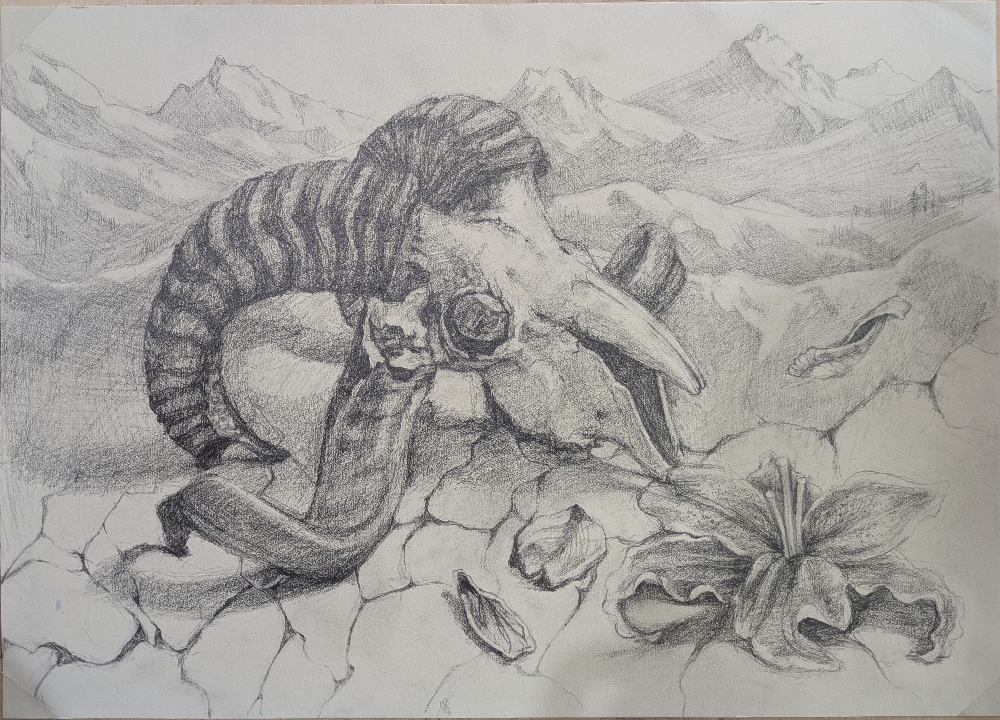
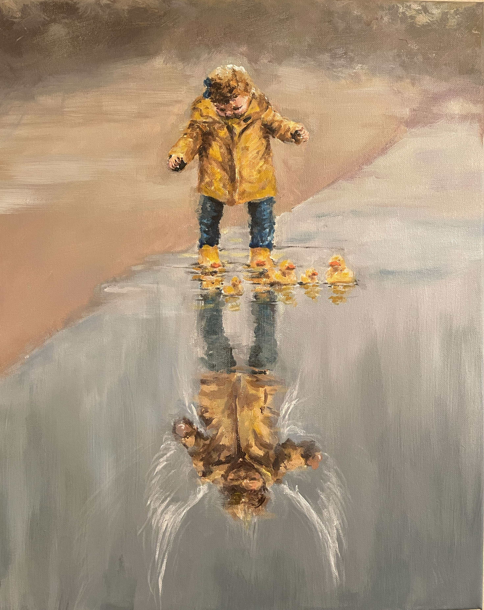
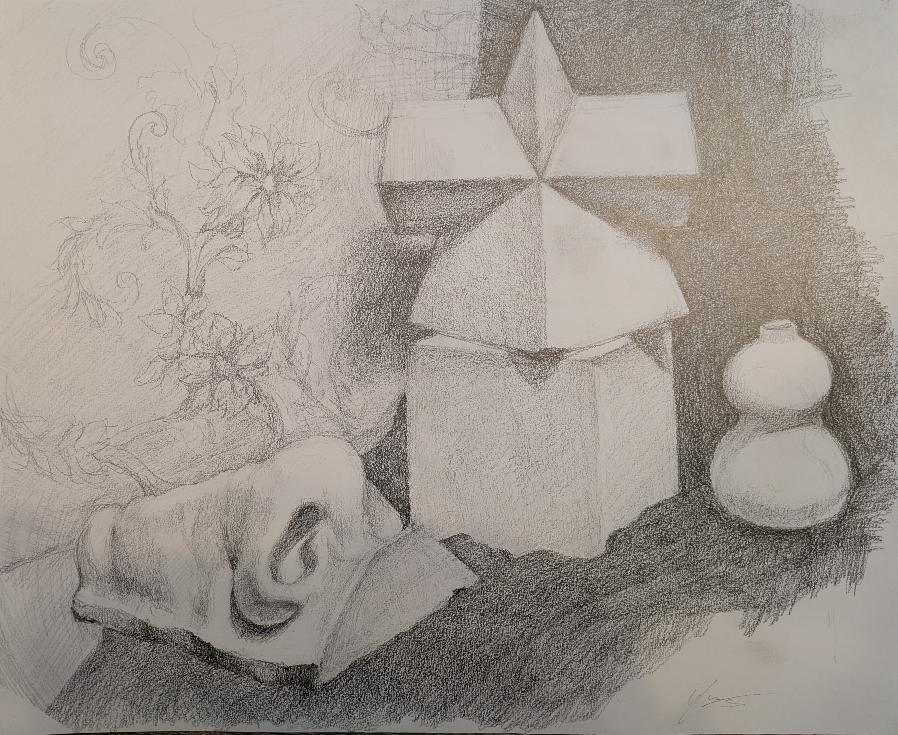
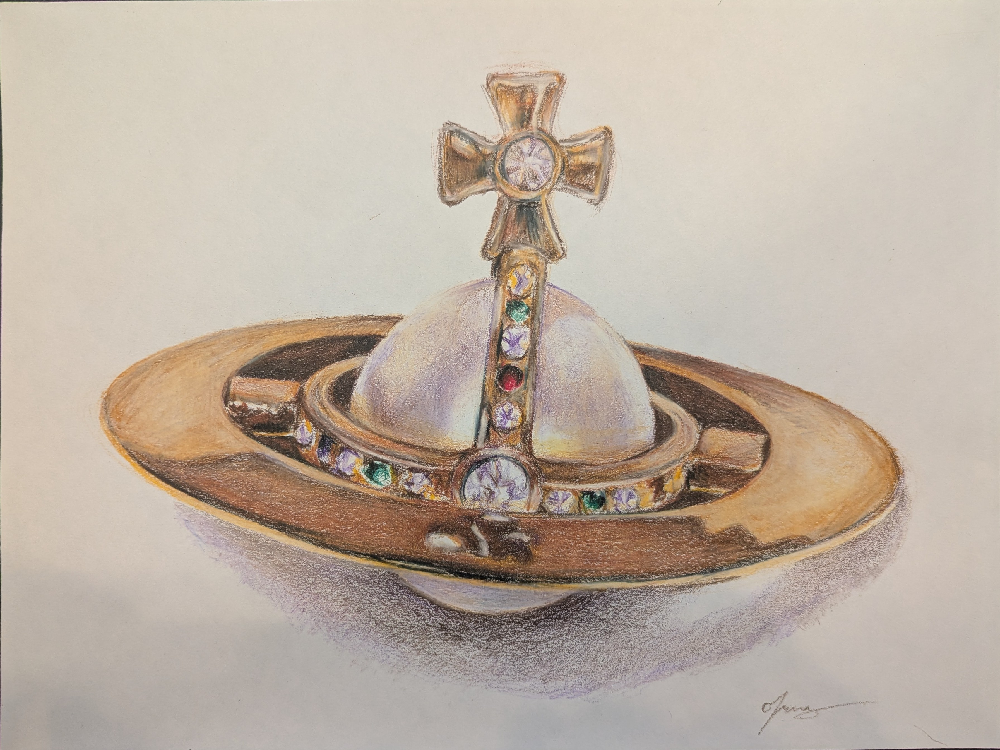

# Technical Drawings

My other selected drawings.

## A Lake in Austria (16x12)

<table width="100%">
  <tr>
    <td width="70%">
        
    </td>
    <td width="30%">
    </td>
  </tr>
</table>

## Still Life (18x12)

<table width="100%">
  <tr>
    <td width="70%">
        
    </td>
    <td width="30%">
    </td>
  </tr>
</table>

## Diving (16x20)

<table width="100%">
  <tr>
    <td width="70%">
        
    </td>
    <td width="30%">
    </td>
  </tr>
</table>

## Anchient Face (9x12)

<table width="100%">
  <tr>
    <td width="70%">
        
    </td>
    <td width="30%">
    </td>
  </tr>
</table>

## Ram Skull (21x15)

<table width="100%">
  <tr>
    <td width="70%">
        
    </td>
    <td width="30%">
    </td>
  </tr>
</table>

## Reflection (18x24)

<table width="100%">
  <tr>
    <td width="70%">
        
    </td>
    <td width="30%">
    </td>
  </tr>
</table>

## Still Life (17x14)

<table width="100%">
  <tr>
    <td width="70%">
        
    </td>
    <td width="30%">
    </td>
  </tr>
</table>

## Necklace (12x9)

<table width="100%">
  <tr>
    <td width="70%">
        
    </td>
    <td width="30%">
    </td>
  </tr>
</table>
